# 🤖 Open Deep Research Agent

### An Autonomous AI Researcher powered by LangGraph, Tavily, and OpenRouter.

[](YOUR_STREAMLIT_APP_LINK_HERE)

## 📖 Overview

The **Open Deep Research Agent** is not just a chatbot—it is an autonomous research assistant designed to perform in-depth web analysis and document synthesis. Unlike standard LLMs that rely solely on training data, this agent actively browses the web, verifies facts, and compiles structured reports with citations.

It features a **Memory System** backed by MongoDB to store your research history and supports **PDF Analysis** to combine internal documents with external web knowledge.

---

## 🏗️ Architecture & Workflow

The system is built on a **State Graph** architecture using `LangGraph`. It treats the research process as a pipeline of specialized agents passing a "State" object between them.


*(Replace the link above with your actual diagram image path)*

### 🔄 The Workflow

The agent follows a cyclical workflow to ensure high-quality output:

```mermaid
graph LR
    User(User Input) --> Planner
    Planner(🧠 Planner Agent) -->|Generates Queries| Searcher
    Searcher(🔎 Searcher Agent) -->|Web Results| Writer
    Writer(✍️ Writer Agent) -->|Final Report| Output
    Output -->|Save| MongoDB
```



1.  **User Input:** The user provides a topic or uploads a PDF.
2.  **Planner:** Analyzes the request to determine if it's a new topic or a follow-up. Generates targeted search queries.
3.  **Searcher:** Executes the search queries using the Tavily API to gather real-time, verified sources.
4.  **Writer:** Synthesizes the search results and PDF context into a coherent, cited report.
5.  **Storage:** The session is saved to a MongoDB cloud database for persistent history.

---

## 🕵️ The Agents

The power of this application lies in the separation of concerns. Instead of one AI doing everything, we split the logic into three distinct roles:

### 1. 🧠 The Planner Agent
*   **Role:** The Strategist.
*   **Function:** It analyzes the conversation history to detect context.
    *   *Is this a follow-up?* -> It generates queries to clarify previous points.
    *   *Is this a new topic?* -> It strictly ignores previous context to prevent "hallucination merging."
*   **Output:** A list of precise search queries optimized for search engines.

### 2. 🔎 The Searcher Agent
*   **Role:** The Investigator.
*   **Function:** It takes the queries from the Planner and uses the **Tavily Search API**.
*   **Capabilities:** It doesn't just get links; it scrapes the content, filters out ads/noise, and extracts the raw text relevant to the query.
*   **Output:** A structured block of "Verified Search Data" containing Titles, URLs, and Content snippets.

### 3. ✍️ The Writer Agent
*   **Role:** The Author.
*   **Function:** It reads the raw data and drafts the final response.
*   **Logic:** It adheres to strict formatting rules:
    *   *General Mode:* detailed summaries.
    *   *Academic Mode:* Strict citation styles and research paper structure.
*   **Output:** A clean, Markdown-formatted report with clickable citations.

---

## 🛠️ Installation & Dependencies

This project relies on a modern AI stack. Here is how each dependency contributes:

| Dependency | Purpose |
| :--- | :--- |
| **`streamlit`** | The frontend framework. It creates the chat interface, sidebar, and file uploader. |
| **`langgraph`** | Manages the "State" and control flow. It allows us to build the Planner -> Searcher -> Writer loop. |
| **`langchain`** | The interface for interacting with LLMs (Large Language Models) like GPT-4 or Claude. |
| **`tavily-python`** | A search engine specifically built for AI agents. It returns clean text instead of messy HTML. |
| **`pymongo`** | Connects the app to MongoDB Atlas (Cloud) to save chat history permanently. |
| **`pypdf`** | Extracts text from uploaded PDF research papers so the agent can "read" them. |
| **`certifi`** | Provides SSL certificates to ensure secure connections to the database. |

---

## 🔑 API Requirements

To run this agent, you need the following API keys:

1.  **OpenRouter API Key** (`OPENROUTER_API_KEY`)
    *   **Why?** To access powerful LLMs (like Google Gemini 2.0 Flash or Claude 3.5 Sonnet) that power the Planner and Writer agents.
2.  **Tavily API Key** (`TAVILY_API_KEY`)
    *   **Why?** To allow the Searcher agent to browse the live internet.
3.  **MongoDB Connection String** (`MONGO_URI`)
    *   **Why?** To store your research history in the cloud so it persists across sessions.

---

## ⚖️ Limitations & Future Roadmap

While powerful, the agent has current limitations we aim to solve:

### ❌ Current Drawbacks
1.  **Token Context Window:** Extremely large PDFs (>100 pages) may be truncated because LLMs have a limit on how much text they can read at once.
2.  **Sequential Processing:** The agent works in steps (Plan -> Search -> Write). If the search fails, the report may be weak. It doesn't yet "self-correct" and search again automatically.
3.  **PDF Images:** It currently extracts text only. Graphs and charts inside PDFs are ignored.

### 🚀 Future Improvements
*   **Self-Correction Loop:** Implementing a "Reviewer Node" that checks the quality of the report and sends it back to the Searcher if data is missing.
*   **GraphRAG:** Implementing a Knowledge Graph to better connect dots between different research papers.
*   **OCR Integration:** Adding a vision model to read charts and images within PDFs.
*   **Export Options:** allowing users to download reports as `.docx` or `.pdf`.

---

## 🏁 Conclusion

The **Open Deep Research Agent** represents a shift from static search to **agentic research**. By combining the reasoning capabilities of LLMs with the real-time knowledge of the web and the persistence of a database, it offers a robust tool for students, researchers, and professionals who need deep insights fast.

### 🔗 Access the Live Agent
**[Click Here to Start Researching](YOUR_STREAMLIT_APP_LINK_HERE)**

---

### 💻 Local Setup Guide

1. **Clone the Repo:**
   ```bash
   git clone https://github.com/your-username/deep-research-agent.git
   cd deep-research-agent
   ```

2. **Install Requirements:**
   ```bash
   pip install -r requirements.txt
   ```

3. **Configure Secrets:**
   Create a `.streamlit/secrets.toml` file:
   ```toml
   OPENROUTER_API_KEY = "sk-..."
   TAVILY_API_KEY = "tvly-..."
   MONGO_URI = "mongodb+srv://..."
   ```

4. **Run the App:**
   ```bash
   streamlit run app.py
   ```
