# 🤖 Open Deep Research Agent

### An Autonomous AI Researcher powered by LangGraph, Tavily, and OpenRouter.

[](https://deepresearchagent-mffwgepvlhywhla8tosr8z.streamlit.app/)

##  Overview

The **Open Deep Research Agent** is not just a chatbot—it is an autonomous research assistant designed to perform in-depth web analysis and document synthesis. Unlike standard LLMs that rely solely on training data, this agent actively browses the web, verifies facts, and compiles structured reports with citations.

It features a **Memory System** backed by MongoDB to store your research history and supports **PDF Analysis** to combine internal documents with external web knowledge.

---

##  System Requirements

Since this agent relies on **Cloud APIs** (OpenRouter, Tavily) for the heavy computational lifting, it is lightweight to run locally. You do **not** need a high-end GPU.

###  Hardware Requirements
*   **Processor (CPU):** Minimum Dual-core processor (Intel i3/Ryzen 3 or equivalent).
*   **RAM:** 4 GB minimum (8 GB recommended for smoother PDF processing).
*   **Storage:** At least 500 MB free space (for libraries and temporary PDF storage).
*   **Internet Connection:** **Critical.** A stable broadband connection is required as the agent constantly communicates with external APIs and the MongoDB cloud database.
*   **GPU:** **Not Required.** (LLM inference is handled via API).

###  Software Requirements
*   **Operating System:** Windows 10/11.
*   **Python:** Version **3.11** or later versions
*   **Web Browser:** Latest version of Chrome, Firefox, Edge, or Safari.
*   **Code Editor:** VS Code (Recommended) or PyCharm for local development.
*   **Git:** To clone the repository.

---

##  Architecture & Workflow

The system is built on a **State Graph** architecture using `LangGraph`. It treats the research process as a pipeline of specialized agents passing a "State" object between them.


###  The Workflow

The agent follows a cyclical workflow to ensure high-quality output:

```mermaid
graph LR
    User(User Input) --> Planner
    Planner(🧠 Planner Agent) -->|Generates Queries| Searcher
    Searcher(🔎 Searcher Agent) -->|Web Results| Writer
    Writer(✍️ Writer Agent) -->|Final Report| Output
    Output -->|Save| MongoDB
```



1.  **User Input:** The user provides a topic or uploads a PDF.
2.  **Planner:** Analyzes the request to determine if it's a new topic or a follow-up. Generates targeted search queries.
3.  **Searcher:** Executes the search queries using the Tavily API to gather real-time, verified sources.
4.  **Writer:** Synthesizes the search results and PDF context into a coherent, cited report.
5.  **Storage:** The session is saved to a MongoDB cloud database for persistent history.

---

##  Agent Roles 

Here is how the individual components interact to form the intelligent system:

###  Planner
The **Planner** acts as the strategist. It is responsible for decision-making before any action is taken.
*   **Context Analysis:** It compares the current query with chat history to classify the intent.
*   **Decision Logic:** It strictly differentiates between a **Follow-up** (bridging context) and a **New Topic** (ignoring history to prevent hallucinations).
*   **Output:** It generates precise, optimized search queries rather than generic text.

###  Writer / Executor
The **Writer** serves as the synthesizer and executor. It transforms raw data into human-readable insight.
*   **Adaptive Formatting:** It dynamically switches styles—producing concise **single paragraphs** for specific answers or detailed **Markdown reports** for deep research.
*   **Fact Verification:** It ensures all claims are backed by the search data.
*   **Citation Engine:** In Academic Mode, it links specific URLs to claims; in General Mode, it provides a clean summary.

###  Pipeline / Agent Flow
The system operates on a linear state graph built with **LangGraph**:

1.  **State Initialization:** The User Input and History are loaded into the shared State.
2.  **Plan:** The Planner Node analyzes the state and outputs a search strategy.
3.  **Execution (Search):** The Searcher Node executes the strategy using the Tavily API to gather live web content and PDF context.
4.  **Synthesis:** The Writer Node compiles the gathered data into the final response.
5.  **Persistence:** The final state is saved to the **MongoDB Cloud** for long-term memory.

---

##  Memory & History Management

The Open Deep Research Agent features a robust, persistent memory system designed to handle long-term research data without "context pollution."

### 1. Cloud Storage (MongoDB Atlas)
Unlike simple chatbots that lose data when the tab closes, this agent uses **MongoDB Atlas (Cloud Database)** for persistent storage.
*   **Auto-Save:** Every research query, generated report, and chat exchange is automatically securely saved to the cloud.
*   **Cross-Device:** Since data is cloud-hosted, you can access your research history from any device or browser.
*   **Management:** Users can **View** past reports, **Resume** old conversations, or **Delete** irrelevant entries permanently from the database.

### 2. Smart Context Logic
To maintain high performance and accuracy, the agent uses a **Sliding Window Strategy**:
*   **Token Optimization:** The agent actively recalls the full text of the **last 2 exchanges** for immediate follow-ups.
*   **Context Truncation:** Older messages (up to 10) are summarized or truncated. This prevents the "Ghosting Effect" (where the AI gets confused by old, irrelevant topics).
*   **Topic Isolation:** The **Planner Agent** intelligently analyzes new queries. If it detects a **New Topic** (unrelated to history), it forces the system to ignore previous context, ensuring a fresh, unbiased search.

---

##  Outputs / Results

The **Open Deep Research Agent** is designed to produce high-quality, structured text outputs tailored to the user's selected mode.

### 1. Output Types
The system dynamically adjusts its output format based on the "Settings" tab:

*   **General Web Reports:**
    *   Produces articulate, easy-to-read summaries suitable for general knowledge or quick answers.
    *   Focuses on clarity, bullet points, and direct answers.
*   **Academic Research Papers:**
    *   Produces a rigorous academic format including **Abstract, Literature Review, Methodology, and References**.
    *   Enforces strict citation rules (clickable Markdown links) and technical depth.
*   **PDF Analysis:**
    *   Combines internal knowledge (from uploaded documents) with external web validation.

### 2. Sample Screenshots

| **Dashboard & History** | **Generated Academic Report** |
|:---:|:---:|
| *[Screenshot of Sidebar/History]* | *[Screenshot of a Final Report]* |
|  |  |


---

##  Installation & Dependencies

This project relies on a modern AI stack. Here is how each dependency contributes:

| Dependency | Purpose |
| :--- | :--- |
| **`streamlit`** | The frontend framework. It creates the chat interface, sidebar, and file uploader. |
| **`langgraph`** | Manages the "State" and control flow. It allows us to build the Planner -> Searcher -> Writer loop. |
| **`langchain`** | The interface for interacting with LLMs (Large Language Models) like GPT-4 or Claude. |
| **`tavily-python`** | A search engine specifically built for AI agents. It returns clean text instead of messy HTML. |
| **`pymongo`** | Connects the app to MongoDB Atlas (Cloud) to save chat history permanently. |
| **`pypdf`** | Extracts text from uploaded PDF research papers so the agent can "read" them. |

---

##  API Requirements

To run this agent, you need the following API keys:

1.  **OpenRouter API Key** (`OPENROUTER_API_KEY`)
    *   **Why?** To access powerful LLMs (like Google Gemini 2.0 Flash or Claude 3.5 Sonnet) that power the Planner and Writer agents.
2.  **Tavily API Key** (`TAVILY_API_KEY`)
    *   **Why?** To allow the Searcher agent to browse the live internet.
3.  **MongoDB Connection String** (`MONGO_URI`)
    *   **Why?** To store your research history in the cloud so it persists across sessions.

---

##  Limitations & Future Roadmap

While powerful, the agent has current limitations we aim to solve:

###  Current Drawbacks
1.  **Token Context Window:** Extremely large PDFs (>100 pages) may be truncated because LLMs have a limit on how much text they can read at once.
2.  **Sequential Processing:** The agent works in steps (Plan -> Search -> Write). If the search fails, the report may be weak. It doesn't yet "self-correct" and search again automatically.
3.  **PDF Images:** It currently extracts text only. Graphs and charts inside PDFs are ignored.

###  Future Improvements
*   **Self-Correction Loop:** Implementing a "Reviewer Node" that checks the quality of the report and sends it back to the Searcher if data is missing.
*   **GraphRAG:** Implementing a Knowledge Graph to better connect dots between different research papers.
*   **OCR Integration:** Adding a vision model to read charts and images within PDFs.
*   **Export Options:** allowing users to download reports as `.docx` or `.pdf`.

---

##  Conclusion

The **Open Deep Research Agent** represents a shift from static search to **agentic research**. By combining the reasoning capabilities of LLMs with the real-time knowledge of the web and the persistence of a database, it offers a robust tool for students, researchers, and professionals who need deep insights fast.


### 🔗 Access the Live Agent
**[Click Here to Start Researching](https://deepresearchagent-mffwgepvlhywhla8tosr8z.streamlit.app/)**

---

### 💻 Local Setup Guide (Execute each line seperately)

1. **Clone the Repo:**
   ```bash
   git clone https://github.com/HarshaVardhanLanka/DeepResearchAgent.git
   cd DeepResearchAgent
   ```
   
2. **Create a Virtual Environment:**
   ```bash
   python -m venv venv
   venv\Scripts\activate
   ```
   
3. **Install Requirements:**
   ```bash
   pip install -r requirements.txt
   ```

4. **Configure Secrets:**
   Create a `.streamlit/secrets.toml` file:
   ```toml
   OPENROUTER_API_KEY = "sk-..."
   TAVILY_API_KEY = "tvly-..."
   MONGO_URI = "mongodb+srv://..."
   ```

5. **Run the App:**
   ```bash
   streamlit run app.py
   ```
   
